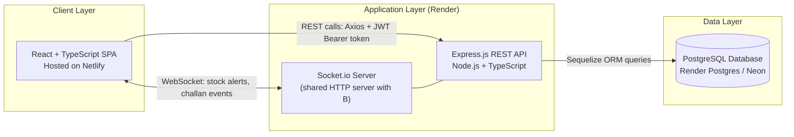
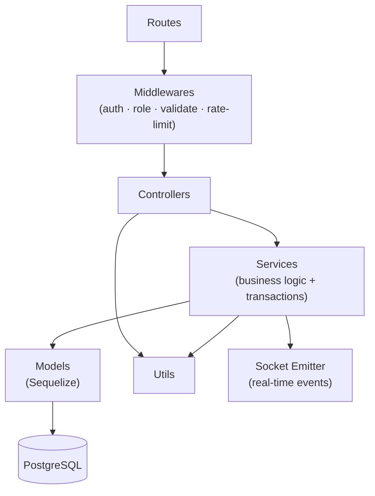
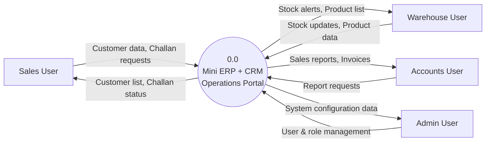
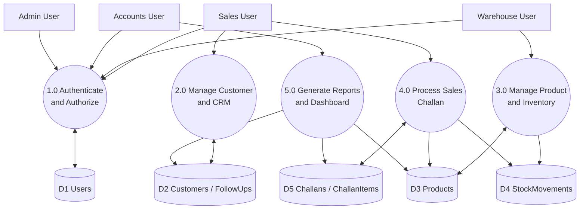
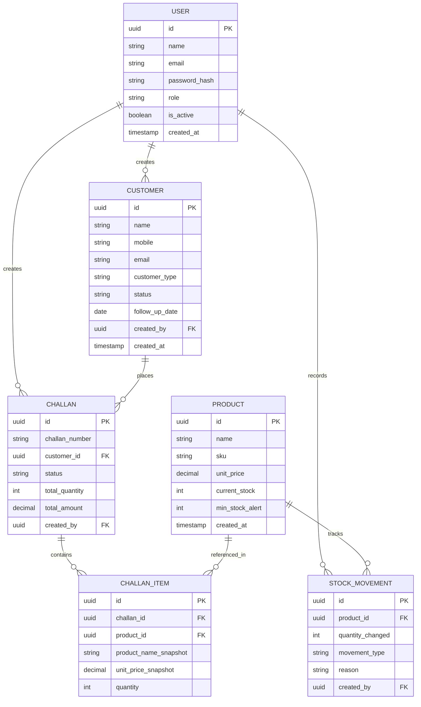
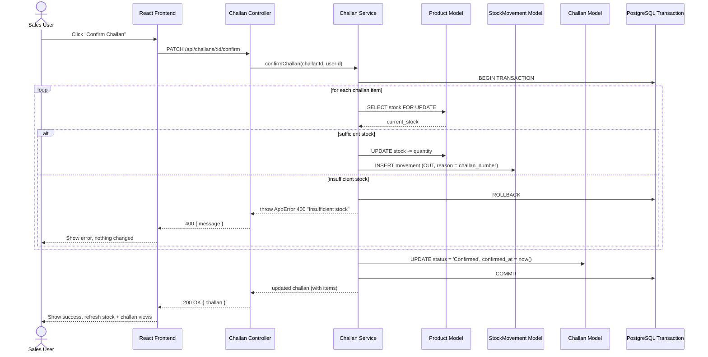

# Mini ERP + CRM Operations Portal

A complete full-stack implementation of a Mini ERP + CRM Operations Portal. It was built with a React frontend and a Node.js (Express) backend connecting to a PostgreSQL database via Sequelize.

---

## 🚀 Live Links & Credentials

- **Live Frontend URL:** [https://fundsroom-erp-ui.netlify.app](https://fundsroom-erp-ui.netlify.app)
- **Live Backend API URL:** [https://fundsroom-assignment-kr0x.onrender.com/api](https://fundsroom-assignment-kr0x.onrender.com/api)

> **Note:** The backend is hosted on Render's free tier, which sleeps after 15 minutes of inactivity. If the frontend feels unresponsive on the first load, please allow up to 30-50 seconds for the backend to wake up.

### Test Credentials
The database is pre-seeded with test accounts for each role. The password for **all** accounts is `password123`.

- **Admin:** `admin@fundsroom.com`
- **Sales:** `sales@fundsroom.com`
- **Warehouse:** `warehouse@fundsroom.com`
- **Accounts:** `accounts@fundsroom.com`

---

## 🏗 High-Level Architecture Diagram

The system strictly follows a layered 3-tier architecture separating the client, API server, and database layer.



### Layered Architecture (Backend)
We use a **layered/N-tier architecture**, which is the industry-standard pattern for Express + TypeScript APIs:



---

## 🔄 Data Flow Diagrams (DFD)

### Level 0 (Context Diagram)


### Level 1 (Major Processes)


---

## 🗄️ Database Design (ERD)



---

## ⚙️ Core Workflows

### Challan Confirm & Stock Deduction
When a Sales user confirms a challan, a single transaction is created. The system locks the product rows, checks for sufficient stock, deducts the stock, records a `StockMovement`, and marks the challan as `Confirmed`. If any step fails, the entire transaction rolls back cleanly.



---

## 🛠️ Local Setup & Deployment Instructions

### Prerequisites
- Node.js (v18+)
- PostgreSQL (running locally or remotely via Neon)
- npm or yarn

### 1. Database Setup
Create a local PostgreSQL database for the project:
```sql
CREATE DATABASE erp_crm;
```

### 2. Backend Setup
```bash
cd backend
npm install

# Setup environment variables
cp .env.example .env
# Edit .env with your local DATABASE_URL and JWT secrets

# Run migrations and seed data
npx sequelize-cli db:migrate
npm run seed

# Start the dev server
npm run dev
```

### 3. Frontend Setup
```bash
cd frontend
npm install

# Setup environment variables
cp .env.example .env
# Ensure VITE_API_BASE_URL points to http://localhost:5000/api

# Start the dev server
npm run dev
```

---

## 📖 API Documentation & Postman

The backend exposes a RESTful API. To test these via Postman:
1. Send a `POST` request to `https://fundsroom-assignment-kr0x.onrender.com/api/auth/login`.
2. Provide the JSON body: `{"email": "admin@fundsroom.com", "password": "password123"}`.
3. Extract the `accessToken` from the response.
4. Go to the **Authorization** tab in Postman for your subsequent requests, select **Bearer Token**, and paste the token.

### Core Endpoints
- `POST /api/auth/login` - Authenticate and receive tokens
- `GET /api/customers` - List customers (paginated/filtered)
- `POST /api/customers` - Create customer
- `GET /api/products` - List products
- `GET /api/products/low-stock` - Get low stock alerts
- `POST /api/stock/movements` - Manually adjust stock
- `GET /api/challans` - List challans
- `POST /api/challans` - Create draft challan
- `PATCH /api/challans/:id/confirm` - Confirm challan (deducts stock)

---

## ⚠️ Known Limitations & Incomplete Parts

While the core functionality is robust, there are a few known limitations due to the scope of this case study:
1. **Real-Time Layer:** The architecture spec calls for Socket.io integration for real-time stock alerts. The socket infrastructure exists on the backend, but the frontend currently relies on TanStack Query polling/refetching instead of active WebSocket connections.
2. **PDF Generation:** While the backend structure supports a `pdfGenerator` utility, actual PDF invoice generation for confirmed challans has not been fully implemented.
3. **Advanced Filtering:** The frontend tables support basic pagination, but advanced multi-column filtering has not been exposed in the UI.
4. **Audit Logs:** While `StockMovements` act as a ledger, full audit logs (who changed customer details, when) are not yet implemented.